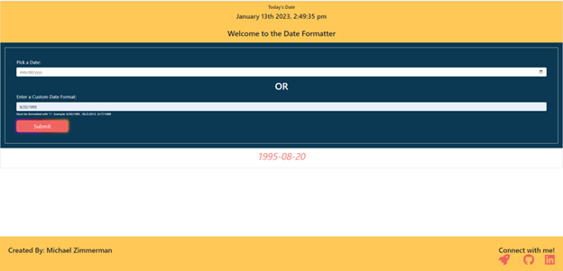

# date-formatter

## Description

The Date Formatter is a spinoff to a job application coding assessment. 

Backstory: I was applying to a Full Stack Web Developement position and it required a multiple choice section and coding section. Within the coding Section there was an algorithm that read: "Question: Return a string in the format YYYY-MM-DD given a date in the formats: MM/DD/YYYY,M/D/YYYY,MM/D/YYYY,or M/D/YYY and format it to YYYY-DD-MM".

I was able to solve the algorithm but shortly after submission I thought about several ways I could implement my code and refactor it to make it better. 

In result, came the Date Formatter application.

 The application also utilizes Bootstrap, HTML, font-awesome, CSS, Moment.js. It takes in a specific date and formats it to YYYY-DD-MM.

  ## Table of Contents 
  * [Usage](#usage)
  * [Important-Links](#Important-Links)
  * [Questions](#questions)

## Usage
The user will input or select a date that the want to get formatted. The output will display below the Formatter. 

   
 
   
 
    

 ## Important Links 
* GitHub Link: https://github.com/MichaelZimm20/date-formatter

* Live Deployment Link: https://michaelzimm20.github.io/date-formatter/

## Questions 
  If you have any questions or concerns, contact:
  * GitHub: [MichaelZimm20](https://github.com/MichaelZimm20)
